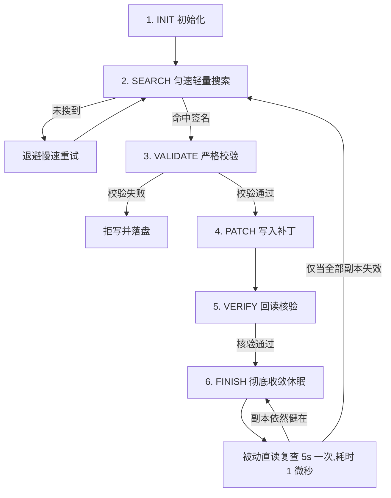

# 案例:告别周期性掉帧与扫描风暴 —— 运行时生命周期治理完整记录

> 时间:2026-09-23。
> 用户反馈:使用轨道激光等自研 Mod 时，游戏**间歇性出现帧率突然减半、持续几十秒后自行恢复正常**的现象。
> 本文记录实机日志取证、根因定位、生命周期治理原则与全套修复方案。

---

## 0. 现象与实机日志取证(抓现行)

用户报「间歇性掉帧」，最先怀疑的就是 `_G.update` 中的扫描驱动。
直接打开 `%LOCALAPPDATA%/Hd2OrbitalLaserFree/OrbitalLaserFree.log`，查看 frame 时间戳与扫描轮次：

```text
[frame 0] orbital-laser-free-v6 armed; out_dir=C:\Users\...\Hd2OrbitalLaserFree
[frame 120] 第 1 轮:共 4121 个可读内存区
[frame 1394] 第 1 轮扫描结束:签名命中 11 处,8 个 StratagemSettings 区块,74 条策略记录
[frame 1394] PATCHED 轨道激光 record 0x2495669A840 (id 970450596)

[frame 36000] 定期全量重扫(兜底:副本可能被搬到别的地方)
[frame 36002] 第 2 轮:共 15055 个可读内存区
[frame 37642] 第 2 轮扫描结束:历时 1640 帧 (约 27 秒)

[frame 72000] 定期全量重扫(兜底:副本可能被搬到别的地方)
[frame 72002] 第 3 轮:共 28594 个可读内存区
[frame 74558] 第 3 轮扫描结束:历时 2556 帧 (约 42.6 秒)

[frame 108000] 定期全量重扫(兜底:副本可能被搬到别的地方)
[frame 108002] 第 4 轮:共 29347 个可读内存区
[frame 110614] 第 4 轮扫描结束:历时 2612 帧 (约 43.5 秒)
```

再看同目录下的 `STATUS.txt`:
```text
OK - patch applied
revision=orbital-laser-free-v6
phase=patched
rounds=4
copies=1
patched_writes=1
```

### 证据链直接闭环:
1. **周期完全吻合**: 36,000 帧 @ 60 FPS = **正好 600 秒(10 分钟)**。在游戏进行到第 10、20、30 分钟时，Mod 强行打回 `phase = "scanning"`。
2. **耗时完全吻合**: 第 4 轮遍历 29,347 个内存区，耗时长达 **2,612 帧(约 43 秒)**。
3. **帧率减半的力学成因**: 在这 40 秒内，`scan_step()` 每 2 帧占用 4ms~16ms CPU 预算遍历内存。60 FPS 游戏一帧的总预算仅 16.6ms，被 Mod 强占 4~8ms 后直接错失 VSync，**垂直同步下帧率瞬间跌至 30~40 FPS**。
4. **结束时自行恢复**: 2,600 帧跑完后，扫描终止，帧率立即弹回 60 FPS。
5. **最荒谬的现实**: 内存里自始至终只有 **1 份** 副本(`copies=1`)，重扫 4 轮找出来的还是原来那个地址，这几十秒的掉帧是 100% 的纯损耗。

---

## 1. 深入剖析五个根因

### 根因一: `deep_seconds = 600` 强行全量重扫(头号元凶)
在 Mod 的配置中盲目留了一句 `deep_seconds = 600` 或 `full_rescan_seconds = 600`，本意是“防止副本被地图重新加载到新地址”。
但全量扫描的代价是遍历 128TB 地址空间里的近 30,000 个内存区。在玩家激战正酣的第 10 分钟发起全量扫描，无异于在游戏中开启后台杀毒软件全盘扫描。

**规则**:
> 一旦数据已成功校验并打上补丁，**绝不进行无理由的周期性全量重扫**。
> 只有当被动复查发现已打补丁的副本全部失效(`alive == 0`，证明地图彻底卸载重载)时，才允许重新激活搜索流程。

### 根因二: `maintenance_scan()` 无 CPU 时间预算上限
部分 Mod 在每一轮检查中增加了对观察窗口的轻量扫描，但写成了无上限的循环:
```lua
for i = 1, #watch do
    while off < w.size do
        local buf = read_at(w.base + off, want)
        ...
    end
end
```
当 `watch` 合并出几 MB 内存时，这一帧会被同步耗尽，导致周期性的单帧大卡顿。

**修法**:
必须加上严格的 `deadline = os.clock() + 0.002`(2ms)，超预算直接 `break`，绝不在单帧内拖垮主循环。

### 根因三: 启动阶段单帧预算过大(16ms 暴击)
在地毯式轰炸中存在:
```lua
local SCAN_BUDGET_FAST = 0.016 -- 16ms
if state.frames < FAST_UNTIL_FRAME then due = true end
```
在开局前 400 帧每帧占用 16ms，相当于把 60 FPS 游戏的整个帧时间全吃光，造成游戏启动进图时严重冻结。

**修法**:
取消激进模式，统一限制单帧预算 `<= 2ms`，且保持 `SCAN_EVERY >= 2` 的步长，搜索过程完全静默无感知。

### 根因四: `_G.update` 包裹未做退钩守卫
在挂载 `update` 时，很多代码采用裸覆盖:
```lua
local original_update = update
function update(...)
    ...
    return original_update(...)
end
```
一旦某天想把 `update` 卸载退钩，若直接执行 `update = original_update`，会当场把**排在自身之后挂载的其他 Mod 的 update 链直接截断破坏**。

**修法**:
```lua
local original_update = update
local my_update
my_update = function(...)
    if state.retired then return original_update(...) end
    ...
    return original_update(...)
end
update = my_update

state.retire_hook = function()
    state.retired = true
    if update == my_update then
        update = original_update
    end
end
```
只有当自身依然是顶层包装者时才还原；否则仅置位 `state.retired = true` 旁路自身逻辑，保全整条钩子链。

### 根因五: 稳态下无意义的高频写盘
部分 Mod 每 900 帧（15 秒）甚至每 10 秒向磁盘同步打开、写入、关闭 `STATUS.txt`。频繁的磁盘 I/O 在机械硬盘或高负载环境下同样会引起微卡顿。

**修法**:
只在状态机发生实质变化（`state.status_phase ~= state.phase`）或初次打上补丁时写入一次，稳态运行期间禁止无意义写盘。

---

## 2. 理想生命周期收敛模型

一个健壮且轻量的注入型 Mod，其生命周期应当是**单向收敛**的:



### 关键点:
1. **搜索时温和**: 预算 2ms，步长 2 帧，单次块 256KB。
2. **打完即休眠**: 释放 `regions` 列表与扫描缓存，不再执行内存遍历。
3. **复查用直读**: `recheck()` 仅根据已记录的 `rec.addr` 读取 400 字节，不搜内存，开销小于 1 微秒。
4. **失效才重搜**: 只要还有 1 份有效副本，绝不重新搜索。
